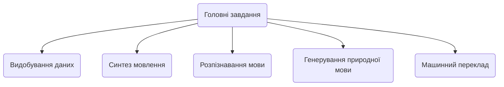
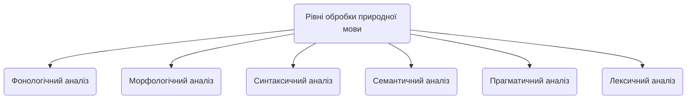

## ЗМІСТ

1. Вступ.

2.	1. Електронний документообіг.
		1.1. Поняття електронного документа.
		1.2. Системи електронного документообігу.

3. Висновок.

4. Список літератури.
  

# Вступ

Питання про необхідність автоматизації управління документообігом давно перейшло в практичну площину і все більше українських підприємств впроваджують у себе системи електронного документообігу (СЕД), дозволяючи організаціям вже на власному досвіді оцінити переваги нової технології роботи з документами. Необхідність в автоматизації управління документообігом різні організації сьогодні бачать по-різному: одні - у підвищенні ефективності організаційно-розпорядчого документообігу (ОРД), інші - у підвищенні ефективності роботи функціональних фахівців, що створюють документи і використовують їх у повсякденній роботі, і лише деякі приділяють увагу обом аспектам. Документоорієнтовані інформаційні сиситеми можна розділити на три основні групи: системи діловодства, системи документообігу та системи управління документами.  
  

# 1. Електронний документообіг

## 1.1. Поняття електронного документа

В останнє десятиліття з'явилися і набули поширення нові інструментальні засоби ефективного забезпечення управлінських процесів. У тому числі мова йде про програмне забезпечення, призначеному для обробки управлінських документів. Тут насамперед слід згадати програмне забезпечення класів "системи управління документами" і "системи управління діловими процесами". Такі системи є програмні комплекси, що застосовуються для вирішення ряду завдань, в тому числі і для побудови корпоративних систем електронного документообігу. У рамках автоматизації процесу обробки документа в організації з моменту його створення або отримання до моменту відправки кореспонденту або завершення виконання і направлення документів до справи повинно бути забезпечено вирішення наступних функцій:

- реєстрація документів, що входять в організацію, що виходять з організації і внутрішніх документів;

- облік резолюцій, виданих за документами керівництвом організації, і постановка документів на контроль;

- централізований контроль виконання документів;

- направлення документів до справи;

- ведення інформаційно-довідкової роботи;

- формування діловодних звітів організації в цілому.

Використання системи електронного документообігу дозволяє організувати передачу даних про хід виконання документів в електронному вигляді, що якісно змінює організацію контролю виконання документів. Картки зареєстрованих централізовано документів з резолюціями керівництва розсилаються в електронному вигляді співробітникам відповідних підрозділів. Вони доповнюють їх резолюціями з виконання документів, що видаються керівниками структурних підрозділів. У міру появи даних про хід виконання документів ці дані вносяться в систему. При цьому система автоматично відстежує настання дати попереднього повідомлення про наближення строку виконання й настання самого цього терміну. Зацікавлені користувачі системи інформуються про названі терміни.  
Також значно видозмінюється процес узгодження проектів документів, в рамках якого співробітники, що беруть участь в процесі узгодження, отримують можливість обмінюватися електронними версіями узгоджуваних проектів. Така технологія дозволяє скоротити час, що витрачається на передачу проектів в паперовому вигляді. 

## 1.2. Порівняльна таблиця систем електронного документообігу
Порівняння систем електронного документообігу здійснено в кількісній формі. Для характеристики було використано таку систему оцінювання:  
- 0 балів – можливість не реалізована;  
- 0,5 балів – неповна реалізація можливості (або з допомогою додаткового програмного забезпечення);
- 1 бал – можливість повністю реалізована.

|Х-стика|Megapolis. Документообіг|OPTIMA-WorkFlow|АСКОД|Док Проф|El-Dok|
|-|-|-|-|-|-|
|Клас СЕД|сист. ел. упр. док.|сист. ел. упр. док.|сист. ел. упр. док.|сист. ел. упр. док.|сист. ел. упр. док.|
|Реєстрація документів|1|1|1|1|1|
|Накладання резолюції|1|1|1|1|1|
|Контроль виконання|1|1|1|1|1|
|Маршрутизація документів|0|1|1|0|0,5|
|Централізоване сховище документів|1|1|0|0|1|
|Імпорт та експорт документів|0,5|1|0,5|0,5|1|
|Пошук документів|1|1|1|1|1|
|**Підтримка ОС і платформ**|1|1|1|1|1|
|Користувацькі нагадування|0|0|0|0|1
|Інтеграція з іншими ПЗ|1|1|0,5|0|0|
|**Контроль цілісності документів**|1|0,5|1|0,5|0,5|
|Підтримка цифрового підпису(ЕЦП)|1|0,5|1|0|0,5|
|**Автоматичне архівування документів**|1|0,5|0,5|1|1|
|Підтримка українського правопису|1|1|1|1|1|
|Ф-ція українського правопису|1|1|1|1|1|

## 1.3 NLP

[**Обробка природної мови**](https://uk.wikipedia.org/wiki/%D0%9E%D0%B1%D1%80%D0%BE%D0%B1%D0%BA%D0%B0_%D0%BF%D1%80%D0%B8%D1%80%D0%BE%D0%B4%D0%BD%D0%BE%D1%97_%D0%BC%D0%BE%D0%B2%D0%B8 "Обробка природної мови") ([англ.](https://uk.wikipedia.org/wiki/%D0%90%D0%BD%D0%B3%D0%BB%D1%96%D0%B9%D1%81%D1%8C%D0%BA%D0%B0_%D0%BC%D0%BE%D0%B2%D0%B0 "Англійська мова")  _Natural-language processing, NLP_) — загальний напрям [інформатики](https://uk.wikipedia.org/wiki/%D0%86%D0%BD%D1%84%D0%BE%D1%80%D0%BC%D0%B0%D1%82%D0%B8%D0%BA%D0%B0 "Інформатика"), [штучного інтелекту](https://uk.wikipedia.org/wiki/%D0%A8%D1%82%D1%83%D1%87%D0%BD%D0%B8%D0%B9_%D1%96%D0%BD%D1%82%D0%B5%D0%BB%D0%B5%D0%BA%D1%82 "Штучний інтелект") та [математичної лінгвістики](https://uk.wikipedia.org/wiki/%D0%9C%D0%B0%D1%82%D0%B5%D0%BC%D0%B0%D1%82%D0%B8%D1%87%D0%BD%D0%B0_%D0%BB%D1%96%D0%BD%D0%B3%D0%B2%D1%96%D1%81%D1%82%D0%B8%D0%BA%D0%B0 "Математична лінгвістика"). Він вивчає проблеми [комп'ютерного аналізу](https://uk.wikipedia.org/w/index.php?title=%D0%9A%D0%BE%D0%BC%D0%BF%27%D1%8E%D1%82%D0%B5%D1%80%D0%BD%D0%B8%D0%B9_%D0%B0%D0%BD%D0%B0%D0%BB%D1%96%D0%B7&action=edit&redlink=1 "Комп'ютерний аналіз (ще не написана)") та синтезу [природної мови](https://uk.wikipedia.org/wiki/%D0%9F%D1%80%D0%B8%D1%80%D0%BE%D0%B4%D0%BD%D0%B0_%D0%BC%D0%BE%D0%B2%D0%B0 "Природна мова"). Стосовно штучного інтелекту аналіз означає розуміння мови, а [синтез](https://uk.wikipedia.org/wiki/%D0%A1%D0%B8%D0%BD%D1%82%D0%B5%D0%B7 "Синтез") — генерацію розумного тексту. Розв'язок цих проблем буде означати створення зручнішої форми взаємодії комп'ютера та людини.

## Головні завдання

-   [Видобування даних](https://uk.wikipedia.org/wiki/%D0%92%D0%B8%D0%B4%D0%BE%D0%B1%D1%83%D0%B2%D0%B0%D0%BD%D0%BD%D1%8F_%D0%B4%D0%B0%D0%BD%D0%B8%D1%85 "Видобування даних"): вивчення даних, пошук зв'язків та закономірностей між ними
-   [Синтез мовлення](https://uk.wikipedia.org/wiki/%D0%A1%D0%B8%D0%BD%D1%82%D0%B5%D0%B7_%D0%BC%D0%BE%D0%B2%D0%BB%D0%B5%D0%BD%D0%BD%D1%8F "Синтез мовлення"): озвучення/прочитання тексту (документ, повідомлення і т. д.) голосом, який є наближеним до природного
-   [Розпізнавання мови](https://uk.wikipedia.org/wiki/%D0%A0%D0%BE%D0%B7%D0%BF%D1%96%D0%B7%D0%BD%D0%B0%D0%B2%D0%B0%D0%BD%D0%BD%D1%8F_%D0%BC%D0%BE%D0%B2%D0%BB%D0%B5%D0%BD%D0%BD%D1%8F "Розпізнавання мовлення"): виведення/розпізнавання тексту з картинок, відсканованих документів або файлів у PDF форматі. Сюди ж входить розпізнавання мовлення, продуковане людським голосом.
-   [Генерування природної мови](https://uk.wikipedia.org/wiki/%D0%93%D0%B5%D0%BD%D0%B5%D1%80%D1%83%D0%B2%D0%B0%D0%BD%D0%BD%D1%8F_%D0%BF%D1%80%D0%B8%D1%80%D0%BE%D0%B4%D0%BD%D0%BE%D1%97_%D0%BC%D0%BE%D0%B2%D0%B8 "Генерування природної мови"): конвертування комп'ютерних даних у природну мову людини.
-   [Машинний переклад](https://uk.wikipedia.org/wiki/%D0%9C%D0%B0%D1%88%D0%B8%D0%BD%D0%BD%D0%B8%D0%B9_%D0%BF%D0%B5%D1%80%D0%B5%D0%BA%D0%BB%D0%B0%D0%B4 "Машинний переклад"): автоматичний переклад з однієї людської мови на іншу. Дане завдання є надзвичайно складним, адже машина не володіє тими знаннями, якими володіє людина, що робить їх «розуміння» тих чи інших фраз абсолютно різним.
-   Питально-відповідальні системи: відповіді на питання, поставлені людською мовою. Зазвичай питання є конкретизованими, наприклад, «Де знаходиться Ейфелева Вежа?», проте існують питання, на які немає конкретної відповіді, наприклад, «Чому всі люди різні?», що робить дане завдання надзвичайно складним для виконання.
-   Розпізнавання/визначення теми: поділ тексту на частини з подальшим визначенням провідної теми для кожної з них.
-   [Інформаційний пошук](https://uk.wikipedia.org/wiki/%D0%86%D0%BD%D1%84%D0%BE%D1%80%D0%BC%D0%B0%D1%86%D1%96%D0%B9%D0%BD%D0%B8%D0%B9_%D0%BF%D0%BE%D1%88%D1%83%D0%BA "Інформаційний пошук"): пошук, розпізнавання та видобування інформації.
-   [Добування даних](https://uk.wikipedia.org/wiki/%D0%94%D0%BE%D0%B1%D1%83%D0%B2%D0%B0%D0%BD%D0%BD%D1%8F_%D0%B4%D0%B0%D0%BD%D0%B8%D1%85 "Добування даних"): отримання  [семантичної](https://uk.wikipedia.org/wiki/%D0%A1%D0%B5%D0%BC%D0%B0%D0%BD%D1%82%D0%B8%D0%BA%D0%B0 "Семантика")  інформації з тексту.
-   Отримання зв'язків: визначення відносин між об'єктами у певному шматку тексту (наприклад, хто з ким працює).
-   Спрощення тексту: зміна, розширення або інша обробка інформації для спрощення структури або  [граматики](https://uk.wikipedia.org/wiki/%D0%93%D1%80%D0%B0%D0%BC%D0%B0%D1%82%D0%B8%D0%BA%D0%B0 "Граматика")  тексту зі збереженням основної думки.
-   Розв'язання  [лексичної](https://uk.wikipedia.org/wiki/%D0%9B%D0%B5%D0%BA%D1%81%D0%B8%D0%BA%D0%B0 "Лексика")  багатоманітності: надання списку можливих значень конкретного багатозначного слова, серед яких можна вибрати найбільш підходяще відповідно до контексту.
-   Розпізнавання  [абревіатур](https://uk.wikipedia.org/wiki/%D0%90%D0%B1%D1%80%D0%B5%D0%B2%D1%96%D0%B0%D1%82%D1%83%D1%80%D0%B0 "Абревіатура")  та заголовків
-   Детектування окремих  [лінгвістичних](https://uk.wikipedia.org/wiki/%D0%9B%D1%96%D0%BD%D0%B3%D0%B2%D1%96%D1%81%D1%82%D0%B8%D0%BA%D0%B0 "Лінгвістика")  одиниць
-   Морфологічна  [декомпозиція](https://uk.wikipedia.org/wiki/%D0%94%D0%B5%D0%BA%D0%BE%D0%BC%D0%BF%D0%BE%D0%B7%D0%B8%D1%86%D1%96%D1%8F "Декомпозиція"): перетворення окремих термінів (наприклад, медичних або технічних) у зрозумілу форму.

## Обмеження 
Однак, існує проблема, яка досі не знайшла свого вирішення, вона коріниться у самій природі людської мови. Проблема розуміння людського мовлення полягає саме у його неоднозначності. Можна виділити наступні види неоднозначностей[[4]](https://uk.wikipedia.org/wiki/%D0%9E%D0%B1%D1%80%D0%BE%D0%B1%D0%BA%D0%B0_%D0%BF%D1%80%D0%B8%D1%80%D0%BE%D0%B4%D0%BD%D0%BE%D1%97_%D0%BC%D0%BE%D0%B2%D0%B8#cite_note-4):

1.  _[Синтаксична](https://uk.wikipedia.org/wiki/%D0%A1%D0%B8%D0%BD%D1%82%D0%B0%D0%BA%D1%81%D0%B8%D1%81 "Синтаксис")  неоднозначність:_  у прислів'ї «Час — не кінь, не підженеш і не зупиниш» для обробки природної мови буде абсолютно неясним те, про що саме йдеться у реченні, про коня чи про час.
2.  _Смислова неоднозначність:_  у питанні «Де знайти ключ до того замку?» слово  _замок_  може мати два абсолютно різні значення, зважаючи на поставлений наголос.
3.  _Відмінкова_  _неоднозначність_: у фразах «Усі були схвильовані перед концертом» та «Не треба давати перед!» слово  _перед_  означає час або місце, що абсолютно змінює сенс фрази.
4.  _Референційна неоднозначність_: у фразі «Відкрий поличку та дістань мокру парасольку, я хочу її висушити» займенник  _її_  за смисловим значенням матиме відношення до мокрої парасольки, проте для машини, у якої повністю відсутнє розуміння реальності, даний  [займенник](https://uk.wikipedia.org/wiki/%D0%97%D0%B0%D0%B9%D0%BC%D0%B5%D0%BD%D0%BD%D0%B8%D0%BA "Займенник")  відноситиметься як до полички, так і до парасольки.

Одним із викликів, який виникає у процесі обробки природної мови, можна вважати проблему  [синонімії](https://uk.wikipedia.org/wiki/%D0%A1%D0%B8%D0%BD%D0%BE%D0%BD%D1%96%D0%BC "Синонім"), в результаті якої одне поняття може бути вираженим декількома різними словами. Як наслідок,  [релевантні](https://uk.wikipedia.org/wiki/%D0%A0%D0%B5%D0%BB%D0%B5%D0%B2%D0%B0%D0%BD%D1%82%D0%BD%D1%96%D1%81%D1%82%D1%8C "Релевантність")  документи, в яких використано синоніми понять, що було вказано користувачем у запиті, може бути не визначено системою.

Вплив вищеперелічених явищ є особливо відчутним при створенні систем машинного перекладу. Проблема полягає у складності встановлення конкретного відображення дійсної семантико-синтаксичної структури речення у його внутрішнє логічне уявлення, яке автоматично генерується системою.[[5]](https://uk.wikipedia.org/wiki/%D0%9E%D0%B1%D1%80%D0%BE%D0%B1%D0%BA%D0%B0_%D0%BF%D1%80%D0%B8%D1%80%D0%BE%D0%B4%D0%BD%D0%BE%D1%97_%D0%BC%D0%BE%D0%B2%D0%B8#cite_note-5)

Розв'язання таких типів неоднозначностей можливе за допомогою введення додаткових значень, які збільшать знання програми про ту чи іншу галузь. Сьогодні програм, які «розуміють» усі типи неоднозначностей у великому спектрі галузей, не існує, проте є програми, що можуть коректно реагувати на неоднозначності у дуже вузьких сферах.

## Розпізнавання іменованих сутностей
**Розпізнавання іменованих сутностей (РІС)**  (також відоме як  **ідентифікація об'єктної сутності, фрагментація об'єктної сутності**  та  **видобуток об'єктної сутності**) — це підзадача  [видобування інформації,](https://uk.wikipedia.org/wiki/%D0%94%D0%BE%D0%B1%D1%83%D0%B2%D0%B0%D0%BD%D0%BD%D1%8F_%D0%B4%D0%B0%D0%BD%D0%B8%D1%85 "Добування даних")  яка намагається знайти і класифікувати  [іменовані сутності](https://uk.wikipedia.org/w/index.php?title=%D0%86%D0%BC%D0%B5%D0%BD%D0%BE%D0%B2%D0%B0%D0%BD%D0%B0_%D1%81%D1%83%D1%82%D0%BD%D1%96%D1%81%D1%82%D1%8C&action=edit&redlink=1 "Іменована сутність (ще не написана)")[[en]](https://en.wikipedia.org/wiki/Named_entity "en:Named entity")  в  [неструктурованому тексті](https://uk.wikipedia.org/w/index.php?title=%D0%9D%D0%B5%D1%81%D1%82%D1%80%D1%83%D0%BA%D1%82%D1%83%D1%80%D0%BE%D0%B2%D0%B0%D0%BD%D1%96_%D0%B4%D0%B0%D0%BD%D1%96&action=edit&redlink=1 "Неструктуровані дані (ще не написана)")[[en]](https://en.wikipedia.org/wiki/Unstructured_data "en:Unstructured data")  в заздалегідь визначені категорії, такі як імена людей, організації, місця,  [медичні коди](https://uk.wikipedia.org/w/index.php?title=%D0%9C%D0%B5%D0%B4%D0%B8%D1%87%D0%BD%D0%B0_%D0%BA%D0%BB%D0%B0%D1%81%D0%B8%D1%84%D1%96%D0%BA%D0%B0%D1%86%D1%96%D1%8F&action=edit&redlink=1 "Медична класифікація (ще не написана)")[[en]](https://en.wikipedia.org/wiki/Medical_classification "en:Medical classification"), час, кількості, грошові значення, відсотки тощо.

Більшість досліджень у системах РІС було структуровано як отримання не коментованого блоку тексту, такого як:

> Джим купив 300 акцій корпорації Acme у 2006.

І створення коментованого блоку тексту, який виділяє імена об'єктів:

> [Джим]{Особа}  купив 300 акцій [корпорації Acme]{Організація}  у [2006]{Час}.

У цьому прикладі було виявлено та класифіковано ім'я особи, що складається з одного  [токену](https://uk.wikipedia.org/wiki/%D0%A2%D0%BE%D0%BA%D0%B5%D0%BD "Токен"), назва компанії з двох токенів та часового виразу.

Сучасні системи РІС для англійської мови показують продуктивність близьку до людської. Наприклад, найкраща система, що коментувала  [MUC-7](https://uk.wikipedia.org/w/index.php?title=%D0%9A%D0%BE%D0%BD%D1%84%D0%B5%D1%80%D0%B5%D0%BD%D1%86%D1%96%D1%8F_%D1%80%D0%BE%D0%B7%D1%83%D0%BC%D1%96%D0%BD%D0%BD%D1%8F_%D0%BF%D0%BE%D0%B2%D1%96%D0%B4%D0%BE%D0%BC%D0%BB%D0%B5%D0%BD%D1%8C&action=edit&redlink=1 "Конференція розуміння повідомлень (ще не написана)")[[en]](https://en.wikipedia.org/wiki/Message_Understanding_Conference "en:Message Understanding Conference"), набрала 93,39 %  [оцінки F1](https://uk.wikipedia.org/w/index.php?title=F-%D0%BC%D1%96%D1%80%D0%B0&action=edit&redlink=1 "F-міра (ще не написана)")[[en]](https://en.wikipedia.org/wiki/F1_score "en:F1 score"), а анотатори — 97,60 % і 96,95 %.[[1]](https://uk.wikipedia.org/wiki/%D0%A0%D0%BE%D0%B7%D0%BF%D1%96%D0%B7%D0%BD%D0%B0%D0%B2%D0%B0%D0%BD%D0%BD%D1%8F_%D1%96%D0%BC%D0%B5%D0%BD%D0%BE%D0%B2%D0%B0%D0%BD%D0%B8%D1%85_%D1%81%D1%83%D1%82%D0%BD%D0%BE%D1%81%D1%82%D0%B5%D0%B9#cite_note-1)[[2]](https://uk.wikipedia.org/wiki/%D0%A0%D0%BE%D0%B7%D0%BF%D1%96%D0%B7%D0%BD%D0%B0%D0%B2%D0%B0%D0%BD%D0%BD%D1%8F_%D1%96%D0%BC%D0%B5%D0%BD%D0%BE%D0%B2%D0%B0%D0%BD%D0%B8%D1%85_%D1%81%D1%83%D1%82%D0%BD%D0%BE%D1%81%D1%82%D0%B5%D0%B9#cite_note-2)
## Визначення проблеми
У виразі  _іменована сутність_, слово «_іменована»_  обмежує завдання для тих сутностей, для яких можна поставити у відповідність один або кілька рядків, таких як слова або фрази, послідовно для деяких  [референтів](https://uk.wikipedia.org/wiki/%D0%A0%D0%B5%D1%84%D0%B5%D1%80%D0%B5%D0%BD%D1%82). Це тісно пов'язане з  [жорсткими позначеннями](https://uk.wikipedia.org/w/index.php?title=%D0%96%D0%BE%D1%80%D1%81%D1%82%D0%BA%D1%96_%D0%BF%D0%BE%D0%B7%D0%BD%D0%B0%D1%87%D0%B5%D0%BD%D0%BD%D1%8F&action=edit&redlink=1 "Жорсткі позначення (ще не написана)")[[en]](https://en.wikipedia.org/wiki/Rigid_designator "en:Rigid designator"), визначеними  [Кріпке](https://uk.wikipedia.org/wiki/%D0%A1%D0%B0%D1%83%D0%BB_%D0%90%D0%B0%D1%80%D0%BE%D0%BD_%D0%9A%D1%80%D1%96%D0%BF%D0%BA%D0%B5 "Саул Аарон Кріпке")[[3]](https://uk.wikipedia.org/wiki/%D0%A0%D0%BE%D0%B7%D0%BF%D1%96%D0%B7%D0%BD%D0%B0%D0%B2%D0%B0%D0%BD%D0%BD%D1%8F_%D1%96%D0%BC%D0%B5%D0%BD%D0%BE%D0%B2%D0%B0%D0%BD%D0%B8%D1%85_%D1%81%D1%83%D1%82%D0%BD%D0%BE%D1%81%D1%82%D0%B5%D0%B9#cite_note-3)[[4]](https://uk.wikipedia.org/wiki/%D0%A0%D0%BE%D0%B7%D0%BF%D1%96%D0%B7%D0%BD%D0%B0%D0%B2%D0%B0%D0%BD%D0%BD%D1%8F_%D1%96%D0%BC%D0%B5%D0%BD%D0%BE%D0%B2%D0%B0%D0%BD%D0%B8%D1%85_%D1%81%D1%83%D1%82%D0%BD%D0%BE%D1%81%D1%82%D0%B5%D0%B9#cite_note-4), хоча на практиці РІС має справу з багатьма іменами та референтами, які не є філософськи «жорсткими». Наприклад,  _автомобільна компанія, створена Генрі Фордом в 1903 році,_  може називатися  _Ford_  або  _Ford Motor Company_, хоча «Ford» також може посилатися на багато інших суб'єктів (див.  [Ford](https://uk.wikipedia.org/wiki/%D0%A4%D0%BE%D1%80%D0%B4 "Форд")). Жорсткі позначення включають власні імена, а також назви певних біологічних видів і речовин,[[5]](https://uk.wikipedia.org/wiki/%D0%A0%D0%BE%D0%B7%D0%BF%D1%96%D0%B7%D0%BD%D0%B0%D0%B2%D0%B0%D0%BD%D0%BD%D1%8F_%D1%96%D0%BC%D0%B5%D0%BD%D0%BE%D0%B2%D0%B0%D0%BD%D0%B8%D1%85_%D1%81%D1%83%D1%82%D0%BD%D0%BE%D1%81%D1%82%D0%B5%D0%B9#cite_note-5)  за виключенням займенників (наприклад, «він», див.  [вирішення кореферентності](https://uk.wikipedia.org/wiki/%D0%9A%D0%BE%D1%80%D0%B5%D1%84%D0%B5%D1%80%D0%B5%D0%BD%D1%82%D0%BD%D1%96%D1%81%D1%82%D1%8C "Кореферентність")), описів референтів за їх властивостями (див. також  [De dicto і de re](https://uk.wikipedia.org/w/index.php?title=De_dicto_%D1%96_de_re&action=edit&redlink=1 "De dicto і de re (ще не написана)")[[en]](https://en.wikipedia.org/wiki/De_dicto_and_de_re "en:De dicto and de re")), а також назв видів речей, на відміну від об'єктів (наприклад, «Банк»).

Повне розпізнавання іменованої сутності часто розбивається, концептуально і, можливо, також в реалізації,[[6]](https://uk.wikipedia.org/wiki/%D0%A0%D0%BE%D0%B7%D0%BF%D1%96%D0%B7%D0%BD%D0%B0%D0%B2%D0%B0%D0%BD%D0%BD%D1%8F_%D1%96%D0%BC%D0%B5%D0%BD%D0%BE%D0%B2%D0%B0%D0%BD%D0%B8%D1%85_%D1%81%D1%83%D1%82%D0%BD%D0%BE%D1%81%D1%82%D0%B5%D0%B9#cite_note-6)  як дві різні задачі: виявлення імен та  [класифікація](https://uk.wikipedia.org/wiki/%D0%97%D0%B0%D0%B4%D0%B0%D1%87%D0%B0_%D0%BA%D0%BB%D0%B0%D1%81%D0%B8%D1%84%D1%96%D0%BA%D0%B0%D1%86%D1%96%D1%97 "Задача класифікації")  їх по типу сутностей (наприклад, особи, організації, місця та інші[[7]](https://uk.wikipedia.org/wiki/%D0%A0%D0%BE%D0%B7%D0%BF%D1%96%D0%B7%D0%BD%D0%B0%D0%B2%D0%B0%D0%BD%D0%BD%D1%8F_%D1%96%D0%BC%D0%B5%D0%BD%D0%BE%D0%B2%D0%B0%D0%BD%D0%B8%D1%85_%D1%81%D1%83%D1%82%D0%BD%D0%BE%D1%81%D1%82%D0%B5%D0%B9#cite_note-conll03intro2-7)). Перша фаза, як правило, зводиться до проблеми сегментації: імена визначаються як суміжні проміжки токенів, без вкладеності, таким чином «Банк Америки» є єдиним ім'ям, попри те, що всередині цього імені підрядок «Америки» є іншим ім'ям. Другий етап вимагає вибору  [онтології](https://uk.wikipedia.org/wiki/%D0%9E%D0%BD%D1%82%D0%BE%D0%BB%D0%BE%D0%B3%D1%96%D1%8F_(%D1%96%D0%BD%D1%84%D0%BE%D1%80%D0%BC%D0%B0%D1%82%D0%B8%D0%BA%D0%B0) "Онтологія (інформатика)"), за допомогою якої можна організувати категорії речей.
## Бібліотеки для NPL 
1. "Наташа" — библиотека для извлечения структурированной информации из текстов на русском языке.
2. NLP Architect — открытая и гибкая библиотека с алгоритмами для обработки текста, которая даёт возможность для взаимодействия разработчиков со всего мира.
3. [spaCy](https://spacy.io/) - це бібліотека програмного забезпечення з відкритим кодом для вдосконаленої обробки природних мов, написана мовами програмування Python та Cython.
4. [StanfordNLP 0.2.0](https://stanfordnlp.github.io/stanfordnlp/) - Python NLP Library for Many Human Languages
5. [AllenNLP](https://demo.allennlp.org/named-entity-recognition)

# Список літератури

1. Автоматизовані інформаційні технології в економіці. Під ред. Титаренко. М.: ИНФРА-М, 1998. - 258 с.  
2. Кузнєцова Т.В. Діловодство (Документаційне забезпечення управління). - М.: ЗАТ «Бізнес-школа« Інтел-Синтез », 2000. - 818 с.  
3. СЭД Megapolis.Документооборот [Электронный ресурс]. – Режим доступа : http://intecracy.com/ru/uslugi/biznes-resheniya/e-dokumentooborot/megapolis-dokumentooborot.html. – Название с экрана.  
4. OPTiMA-WorkFlow [Электронный ресурс]. – Режим доступа : http://www.docva.ru/docflow/sys_review/25.php. – Название с экрана.  
5. Система електронного документообігу АСКОД [Електронний ресурс]. – Режим доступу : http://www.askodbuklet. – Назва з екрану.  
6. Програмний комплекс «Автоматизована система діловодства «ДОК ПРОФ 2.0» [Електронний ресурс]. – Режим доступу : http://krashiy.com/rus/nominations2006/?nid=17&id=31678&pid=423. – Назва з екрану.
7. Вільна енциклопедія Вікіпедія, стаття "Розпізнавання іменованих сутностей" https://uk.wikipedia.org/wiki/%D0%A0%D0%BE%D0%B7%D0%BF%D1%96%D0%B7%D0%BD%D0%B0%D0%B2%D0%B0%D0%BD%D0%BD%D1%8F_%D1%96%D0%BC%D0%B5%D0%BD%D0%BE%D0%B2%D0%B0%D0%BD%D0%B8%D1%85_%D1%81%D1%83%D1%82%D0%BD%D0%BE%D1%81%D1%82%D0%B5%D0%B9
<!--stackedit_data:
eyJoaXN0b3J5IjpbOTEwMDA0NDQzLC0yODc3NzE3NDcsNzY1ND
YwMjc3LDE4NDUzOTA2NDgsMjYzNTMxMTczLDE1ODQ5NTQ5NTMs
NTg0MjIyMDMsMTU0Mzc1MTA1Myw3ODg1NzE0MTYsMTUxNjU4NT
I2MCwtMTYwNTc5NzA2Ml19
-->