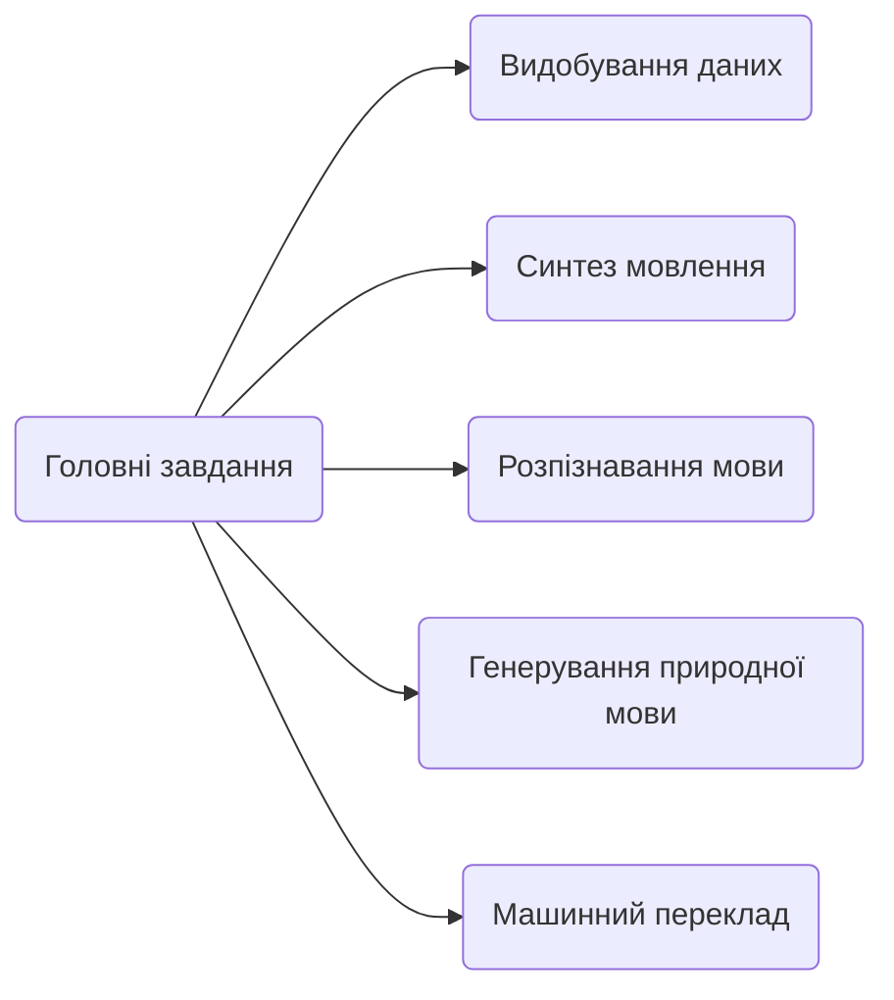
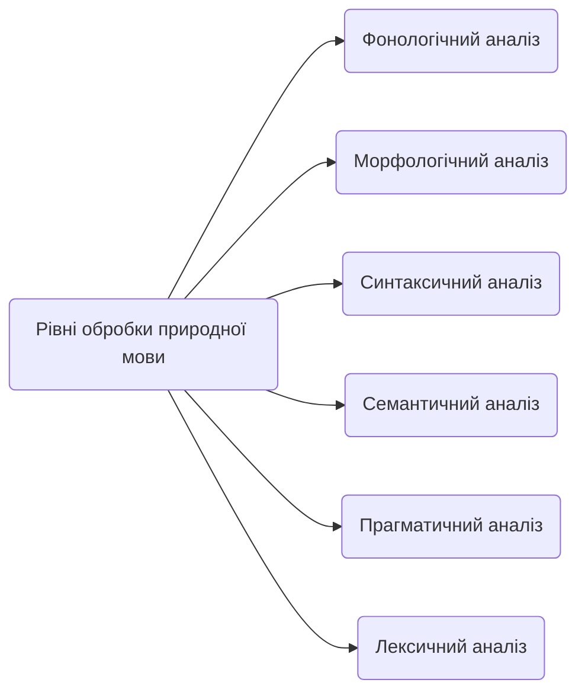

## ЗМІСТ

1. Вступ.

2.	1. Електронний документообіг.
	1.1. Поняття електронного документа.
	1.2. Системи електронного документообігу.

3. Висновок.

4. Список літератури.
  

# Вступ

Питання про необхідність автоматизації управління документообігом давно перейшло в практичну площину і все більше українських підприємств впроваджують у себе системи електронного документообігу (СЕД), дозволяючи організаціям вже на власному досвіді оцінити переваги нової технології роботи з документами. Необхідність в автоматизації управління документообігом різні організації сьогодні бачать по-різному: одні - у підвищенні ефективності організаційно-розпорядчого документообігу (ОРД), інші - у підвищенні ефективності роботи функціональних фахівців, що створюють документи і використовують їх у повсякденній роботі, і лише деякі приділяють увагу обом аспектам. Документоорієнтовані інформаційні сиситеми можна розділити на три основні групи: системи діловодства, системи документообігу та системи управління документами.  
  

# 1. Електронний документообіг

## 1.1. Поняття електронного документа

В останнє десятиліття з'явилися і набули поширення нові інструментальні засоби ефективного забезпечення управлінських процесів. У тому числі мова йде про програмне забезпечення, призначеному для обробки управлінських документів. Тут насамперед слід згадати програмне забезпечення класів "системи управління документами" і "системи управління діловими процесами". Такі системи є програмні комплекси, що застосовуються для вирішення ряду завдань, в тому числі і для побудови корпоративних систем електронного документообігу. У рамках автоматизації процесу обробки документа в організації з моменту його створення або отримання до моменту відправки кореспонденту або завершення виконання і направлення документів до справи повинно бути забезпечено вирішення наступних функцій:

- реєстрація документів, що входять в організацію, що виходять з організації і внутрішніх документів;

- облік резолюцій, виданих за документами керівництвом організації, і постановка документів на контроль;

- централізований контроль виконання документів;

- направлення документів до справи;

- ведення інформаційно-довідкової роботи;

- формування діловодних звітів організації в цілому.

Використання системи електронного документообігу дозволяє організувати передачу даних про хід виконання документів в електронному вигляді, що якісно змінює організацію контролю виконання документів. Картки зареєстрованих централізовано документів з резолюціями керівництва розсилаються в електронному вигляді співробітникам відповідних підрозділів. Вони доповнюють їх резолюціями з виконання документів, що видаються керівниками структурних підрозділів. У міру появи даних про хід виконання документів ці дані вносяться в систему. При цьому система автоматично відстежує настання дати попереднього повідомлення про наближення строку виконання й настання самого цього терміну. Зацікавлені користувачі системи інформуються про названі терміни.  
Також значно видозмінюється процес узгодження проектів документів, в рамках якого співробітники, що беруть участь в процесі узгодження, отримують можливість обмінюватися електронними версіями узгоджуваних проектів. Така технологія дозволяє скоротити час, що витрачається на передачу проектів в паперовому вигляді.  
Система електронного документообігу обов'язково включає поточний електронний архів, який вирішує проблеми оперативного доступу до інформації та наявності можливості одночасного використання документа декількома співробітниками. Така форма організації зберігання значно знижує ймовірність втрати інформації і підвищує оперативність роботи за рахунок скорочення часу пошуку потрібного документа. Зберігання текстів документів в електронному вигляді дозволяє реалізовувати повнотекстовий пошук, що відкриває принципово нові можливості при веденні інформаційно-довідкової роботи, наприклад, дозволяє робити тематичні добірки документів за їхнім змістом. Використання електронного архіву позбавляє від необхідності створювати фонд користування архівних документів, так як за запитом в будь-який момент може бути видана електронна копія документа.

  
З юридичної точки зору поняття електронного документообігу відрізняється від поняття електронного обміну даними. В основі першого лежить легітимність електронних документів. Тому поряд з удосконаленням інформаційних технологій важливу роль у процесі створення інфраструктури електронного документообігу повинна зіграти його законодавча підтримка, суть якої полягає в наданні даними, створюваним і переданим електронним способом, юридичного статусу документа.  
Основною функцією традиційного документа є посвідчення деякою інформацією. При складанні та використанні документа присутні два аспекти: по-перше, деяка інформація, а по-друге, - сам документ як матеріальна річ, яку можна пред'явити або передати. Наявність цієї матеріальної речі дозволяє підтвердити істинність інформації, що міститься в документі. Можливо, для підтвердження істинності необхідно виконати якусь процедуру - експертизу з перевірки достовірності документа.  
Саму інформацію, що міститься в документі, теж можна розділити на дві частини. Перша частина - безпосередньо зміст, друга - допоміжна інформація, яка дає можливість встановити його автентичність (справжність). До неї належать реквізити типу вихідного номера, підписів і печаток. До складу інформації, як змістовної, так і про носії, можуть входити і дані про час, умови та місце складання документа.  

Необхідно також відзначити, що у випадку паперового документа оригінал існує в обмеженому, відомому заздалегідь кількості примірників. Наприклад, може бути зазначено, що договір здійснено у трьох примірниках, які мають однакову силу. Будь-який додатковий примірник з'явиться копією, що в принципі може бути підтверджено шляхом проведення відповідної експертизи. У ряді випадків істотно наявність саме оригіналу документа. Наприклад, продаж акції, випущеної в документарній формі, зовсім не рівнозначна продажу копії її сертифіката, навіть завіреної нотаріально.  
Таким чином, документ виконує наступні функції:

- фіксація деякою (змістовної) інформації;

- фіксація особи, яка підписала документ;

- фіксація умов складання документа;

- доказ у судовому розгляді;

- функція оригіналу, що забезпечується його унікальністю.

З точки зору традиційного документообігу можна виділити дві основні функції паперового документа: інформаційну і доказову (тобто можливість використовувати його в якості доказу). Головною причиною, через яку саме паперові документи виконують ці функції, є те, що саме папір бу впродовж багатьох століть найбільш поширеним матеріальним носієм, використовуваним для передачі та зберігання інформації. В останні десятиліття ситуація різко змінилася, обсяги переданих в електронному вигляді даних стрімко ростуть. Як зазначалося раніше, системи безпаперового документообігу отримують все більш широке поширення в різних галузях. У зв'язку з цим важливого значення набуває визначення правового статусу електронного документа - окреслення областей, де можливо і допустимо його застосування.  
	 
Вимоги до документа, що випливають з наведеного визначення, можна розділити на три групи:

1. Перша відображає інформаційну функцію документа: документом може бути не будь-яка інформація, зафіксована на паперовому носії, а тільки відомості певного характеру

2. Друга (вимоги до форми) група - це вимоги, що забезпечують доказову функцію документа (реквізитами форми можуть служити наявність печатки та підписи певної особи, персональні дані про особу, який видав документ, а також вимоги до паперового носія, наприклад, папір з захисними знаками і т. п.).

3. Третя група (компетентність джерела документа) як би зв'язує перші дві, надає юридичну значимість документу. Документ, виданий некомпетентним органом, підписаний не уповноваженою на те або анонімною особою, не може служити підтвердженням викладених у ньому відомостей про факти, засвідчувати факти чи підтверджувати права і обов'язки.

Очевидно, легко забезпечити для даних, записаних у комп'ютерному форматі, виконання умов першої і третьої груп. Деякі з вимог до форми документа (наприклад, дотримання певної послідовності викладу змісту і розташування тексту) теж можуть бути дотримані. Інші вимоги частини другої групи (наявність печатки організації, власноручного підпису особи, спеціальний тип паперу) принципово неприйнятні для електронних документів внаслідок специфічної природи комп'ютерних носіїв інформації.

Саме фізичні характеристики електронних документів довгий час були об'єктом критики противників безпаперових систем документообігу. Зокрема, в якості одного з аргументів наводилося наступне твердження: те, що написано на папері, важко видалити і воно залишається навічно; дані ж на комп'ютерних носіях можуть бути легко знищені, вони недовговічні. Але, по-перше, збереження паперових документів в значній мірі залежить від якості паперу і для їх тривалого зберігання необхідно застосування спеціальних заходів, а по-друге, сучасні носії комп'ютерних даних дозволяють зберігати інформацію досить довго і при здійсненні відповідних заходів безпеки (у тому числі і періодичне копіювання) їх надійність не нижче, ніж у традиційних. Крім того, коли мова йде про ділової інформації, звичайно існують певні терміни зберігання такої інформації, що обчислюються роками або десятиліттями, а протягом зазначених строків можливе зберігання навіть магнітних носіїв, не кажучи вже про диски CD-ROM. І, можливо, найвагоміший аргумент. Паперовий документ майже неможливо змінити, в електронний же документ легко внести поправки, і дуже важко потім довести факт їх внесення. Можна, звичайно, зазначити, що підробка традиційних документів має, напевно, не меншу історію, ніж історія писемності, але це не знімає проблеми ідентифікації електронних документів.  
Вирішити прийнятним чином дане завдання вдалося тільки у другій половині 1970-х років, коли американські математики У. Діффі та М. Е. Хеллмен запропонували використовувати цифровий підпис для підтвердження автентичності електронних повідомлень.  
З урахуванням викладеного електронний документ можна визначити як набір даних, записаних в придатному для читання комп'ютера вигляді, для яких виконана така умова: існує визнана учасниками ЕДО або затверджена компетентним органом процедура, що дозволяє однозначно перетворити ці дані в документ традиційного формату. 

## 1.2. Порівняльна таблиця систем електронного документообігу
Порівняння систем електронного документообігу здійснено в кількісній формі. Для характеристики було використано таку систему оцінювання:  
- 0 балів – можливість не реалізована;  
- 0,5 балів – неповна реалізація можливості (або з допомогою додаткового програмного забезпечення);
- 1 бал – можливість повністю реалізована.

|Х-стика|Megapolis. Документообіг|OPTIMA-WorkFlow|АСКОД|Док Проф|El-Dok|
|-|-|-|-|-|-|
|Клас СЕД|сист. ел. упр. док.|сист. ел. упр. док.|сист. ел. упр. док.|сист. ел. упр. док.|сист. ел. упр. док.|
|Реєстрація документів|1|1|1|1|1|
|Накладання резолюції|1|1|1|1|1|
|Контроль виконання|1|1|1|1|1|
|Маршрутизація документів|0|1|1|0|0,5|
|Централізоване сховище документів|1|1|0|0|1|
|Імпорт та експорт документів|0,5|1|0,5|0,5|1|
|Пошук документів|1|1|1|1|1|
|**Підтримка ОС і платформ**|1|1|1|1|1|
|Користувацькі нагадування|0|0|0|0|1
|Інтеграція з іншими ПЗ|1|1|0,5|0|0|
|**Контроль цілісності документів**|1|0,5|1|0,5|0,5|
|Підтримка цифрового підпису(ЕЦП)|1|0,5|1|0|0,5|
|**Автоматичне архівування документів**|1|0,5|0,5|1|1|
|Підтримка українського правопису|1|1|1|1|1|
|Ф-ція українського правопису|1|1|1|1|1|

## 1.3 NLP

**Обробка природної мови** ([англ.](https://uk.wikipedia.org/wiki/%D0%90%D0%BD%D0%B3%D0%BB%D1%96%D0%B9%D1%81%D1%8C%D0%BA%D0%B0_%D0%BC%D0%BE%D0%B2%D0%B0 "Англійська мова")  _Natural-language processing, NLP_) — загальний напрям [інформатики](https://uk.wikipedia.org/wiki/%D0%86%D0%BD%D1%84%D0%BE%D1%80%D0%BC%D0%B0%D1%82%D0%B8%D0%BA%D0%B0 "Інформатика"), [штучного інтелекту](https://uk.wikipedia.org/wiki/%D0%A8%D1%82%D1%83%D1%87%D0%BD%D0%B8%D0%B9_%D1%96%D0%BD%D1%82%D0%B5%D0%BB%D0%B5%D0%BA%D1%82 "Штучний інтелект") та [математичної лінгвістики](https://uk.wikipedia.org/wiki/%D0%9C%D0%B0%D1%82%D0%B5%D0%BC%D0%B0%D1%82%D0%B8%D1%87%D0%BD%D0%B0_%D0%BB%D1%96%D0%BD%D0%B3%D0%B2%D1%96%D1%81%D1%82%D0%B8%D0%BA%D0%B0 "Математична лінгвістика"). Він вивчає проблеми [комп'ютерного аналізу](https://uk.wikipedia.org/w/index.php?title=%D0%9A%D0%BE%D0%BC%D0%BF%27%D1%8E%D1%82%D0%B5%D1%80%D0%BD%D0%B8%D0%B9_%D0%B0%D0%BD%D0%B0%D0%BB%D1%96%D0%B7&action=edit&redlink=1 "Комп'ютерний аналіз (ще не написана)") та синтезу [природної мови](https://uk.wikipedia.org/wiki/%D0%9F%D1%80%D0%B8%D1%80%D0%BE%D0%B4%D0%BD%D0%B0_%D0%BC%D0%BE%D0%B2%D0%B0 "Природна мова"). Стосовно штучного інтелекту аналіз означає розуміння мови, а [синтез](https://uk.wikipedia.org/wiki/%D0%A1%D0%B8%D0%BD%D1%82%D0%B5%D0%B7 "Синтез") — генерацію розумного тексту. Розв'язок цих проблем буде означати створення зручнішої форми взаємодії комп'ютера та людини.

## Підходи до виконання завдань

### Статистичний підхід

В основі статистичного підходу до обробки природної мови лежить припущення, що зміст тексту може бути визначено за найуживанішими словами. Основним завданням даного підходу є визначення кількості повторень конкретного слова в тексті. Основна проблема, з якою стикаються статистичні підходи, полягає в розгляді тексту як набору слів без смислового зв'язку.

### Лінгвістичний підхід

Лінгвістичний підхід до обробки природної мови складається з чотирьох рівнів: графоматичного, морфологічного, синтаксичного та семантичного.

**Перший рівень** полягає у виділенні окремих елементів тексту/документу, наприклад, розділів, абзаців, речень і т. д.

**Другий рівень** полягає у визначенні морфологічних характеристик окремого слова.

**Третій рівень** відповідає за визначення синтаксичної залежності слів у реченнях.

**Четвертий рівень** пов'язаний зі смисловим розумінням тексту, що включає розробки у сфері штучного інтелекту.

### Символічний підхід

Символічний підхід до обробки природної мови здійснює глибинний аналіз лінгвістичних явищ та базується на явному представленні знань, що здійснюється шляхом використання добре досліджених схем представлення знань та алгоритмів, що працюють з ними. Джерелом знання про мову можуть виступати словники, формули та правила, розроблені людьми.

### Коннективістський підхід

Даний метод обробки природної мови відповідає за обробку загальних моделей з використанням конкретних прикладів мовних явищ. Найбільш значуща відмінність коннективістського підходу від інших статистичних методів полягає у поєднанні статистичних знань та різних теорій уявлень, що дозволяють працювати з логічними висновками та трансформацією логічних формул.

### Метод допоміжних векторів

Диференційний метод машинного навчання, що допомагає провести класифікацію слів за категоріями. Даний метод побудований на певній множині властивостей.

### [Прихована марковська модель](https://uk.wikipedia.org/wiki/%D0%9F%D1%80%D0%B8%D1%85%D0%BE%D0%B2%D0%B0%D0%BD%D0%B0_%D0%BC%D0%B0%D1%80%D0%BA%D0%BE%D0%B2%D1%81%D1%8C%D0%BA%D0%B0_%D0%BC%D0%BE%D0%B4%D0%B5%D0%BB%D1%8C)

Диференційний метод машинного навчання, що допомагає провести класифікацію слів за категоріями. Даний метод побудований на певній множині властивостей.

### [Умовні випадкові поля](https://uk.wikipedia.org/w/index.php?title=%D0%A3%D0%BC%D0%BE%D0%B2%D0%BD%D0%B5_%D0%B2%D0%B8%D0%BF%D0%B0%D0%B4%D0%BA%D0%BE%D0%B2%D0%B5_%D0%BF%D0%BE%D0%BB%D0%B5&action=edit&redlink=1 "Умовне випадкове поле (ще не написана)")

Диференційний метод машинного навчання, що допомагає провести класифікацію слів за категоріями. Даний метод побудований на певній множині властивостей.

### [N-грамні](https://uk.wikipedia.org/wiki/N-%D0%B3%D1%80%D0%B0%D0%BC) моделі

Модель побудована на послідовні з _n_ елементів: речень, слів, букв, звуків і т. д. Модель дозволяє розрахувати ймовірність появи будь-якого елемента за відомих ймовірностей появи таких попередніх елементів. Така модель зводиться до скінченної множини ймовірностей, кожну з яких може бути оцінено після обчислення повторюваності відповідних _n_-грам.

# Висновок

Роль систем автоматизації паперового діловодства та документообігу в умовах консервативного стилю роботи з документами, який обумовлений особливостями українського законодавства, що вимагає чіткого документального підтвердження всіх кроків у різноманітних областях діяльності організації, безперечно, велика. Проте розвиток ІКТ поступово відсуває паперовий документ на другий план, істотно підвищуючи роль електронного документа.

У свою чергу, накопичені паперові архіви, за допомогою систем потокового введення паперових документів, можуть бути переведені в електронні архіви. У результаті вивільняється простір, спрощується керованість архіву, підвищується доступність інформації, що зберігається для всіх зацікавлених користувачів, знижується ризик у внаслідок пожежі або інших форс-мажорних обставин. Зрозуміло, повністю позбавитися від паперу в цьому випадку не вдається, оскільки юридично значимої формою документа, як і раніше вважається паперова.

Однак без настільних інтеграційних компонентів, що встановлюються на робочих місцях, не може бути й мови про організацію єдиного сховища документів і підвищення ефективності роботи користувачів. Головне - у організації повинна бути чітко спланована стратегія розвитку автоматизації, а куплені або розробляються блоки, крім усього іншого, повинні володіти необхідними інтеграційними якостями. Конкретний зміст стратегії кожного підприємства визначається його розмірами, галузевою належністю і технологічним рівнем, різноманіттям використовуваних інформаційних систем і багатьма іншими факторами.  
  

# Список літератури

1. Автоматизовані інформаційні технології в економіці. Під ред. Титаренко. М.: ИНФРА-М, 1998. - 258 с.  
2. Кузнєцова Т.В. Діловодство (Документаційне забезпечення управління). - М.: ЗАТ «Бізнес-школа« Інтел-Синтез », 2000. - 818 с.  
3. СЭД Megapolis.Документооборот [Электронный ресурс]. – Режим доступа : http://intecracy.com/ru/uslugi/biznes-resheniya/e-dokumentooborot/megapolis-dokumentooborot.html. – Название с экрана.  
4. OPTiMA-WorkFlow [Электронный ресурс]. – Режим доступа : http://www.docva.ru/docflow/sys_review/25.php. – Название с экрана.  
5. Система електронного документообігу АСКОД [Електронний ресурс]. – Режим доступу : http://www.askodbuklet. – Назва з екрану.  
6. Програмний комплекс «Автоматизована система діловодства «ДОК ПРОФ 2.0» [Електронний ресурс]. – Режим доступу : http://krashiy.com/rus/nominations2006/?nid=17&id=31678&pid=423. – Назва з екрану.
<!--stackedit_data:
eyJoaXN0b3J5IjpbMTUzODU4MDIzMSwxNTE2NTg1MjYwLC0xNj
A1Nzk3MDYyXX0=
-->