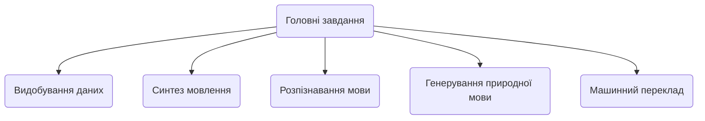
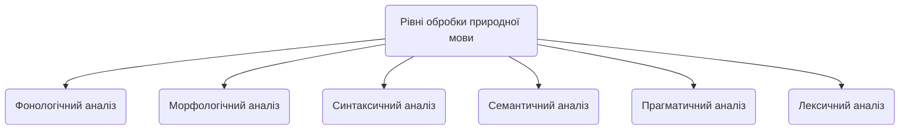

## ЗМІСТ

1. Вступ.

2.	1. Електронний документообіг.
		1.1. Поняття електронного документа.
		1.2. Системи електронного документообігу.

3. Висновок.

4. Список літератури.
  

# Вступ

Питання про необхідність автоматизації управління документообігом давно перейшло в практичну площину і все більше українських підприємств впроваджують у себе системи електронного документообігу (СЕД), дозволяючи організаціям вже на власному досвіді оцінити переваги нової технології роботи з документами. Необхідність в автоматизації управління документообігом різні організації сьогодні бачать по-різному: одні - у підвищенні ефективності організаційно-розпорядчого документообігу (ОРД), інші - у підвищенні ефективності роботи функціональних фахівців, що створюють документи і використовують їх у повсякденній роботі, і лише деякі приділяють увагу обом аспектам. Документоорієнтовані інформаційні сиситеми можна розділити на три основні групи: системи діловодства, системи документообігу та системи управління документами.  
  

# 1. Електронний документообіг

## 1.1. Поняття електронного документа

В останнє десятиліття з'явилися і набули поширення нові інструментальні засоби ефективного забезпечення управлінських процесів. У тому числі мова йде про програмне забезпечення, призначеному для обробки управлінських документів. Тут насамперед слід згадати програмне забезпечення класів "системи управління документами" і "системи управління діловими процесами". Такі системи є програмні комплекси, що застосовуються для вирішення ряду завдань, в тому числі і для побудови корпоративних систем електронного документообігу. У рамках автоматизації процесу обробки документа в організації з моменту його створення або отримання до моменту відправки кореспонденту або завершення виконання і направлення документів до справи повинно бути забезпечено вирішення наступних функцій:

- реєстрація документів, що входять в організацію, що виходять з організації і внутрішніх документів;

- облік резолюцій, виданих за документами керівництвом організації, і постановка документів на контроль;

- централізований контроль виконання документів;

- направлення документів до справи;

- ведення інформаційно-довідкової роботи;

- формування діловодних звітів організації в цілому.

Використання системи електронного документообігу дозволяє організувати передачу даних про хід виконання документів в електронному вигляді, що якісно змінює організацію контролю виконання документів. Картки зареєстрованих централізовано документів з резолюціями керівництва розсилаються в електронному вигляді співробітникам відповідних підрозділів. Вони доповнюють їх резолюціями з виконання документів, що видаються керівниками структурних підрозділів. У міру появи даних про хід виконання документів ці дані вносяться в систему. При цьому система автоматично відстежує настання дати попереднього повідомлення про наближення строку виконання й настання самого цього терміну. Зацікавлені користувачі системи інформуються про названі терміни.  
Також значно видозмінюється процес узгодження проектів документів, в рамках якого співробітники, що беруть участь в процесі узгодження, отримують можливість обмінюватися електронними версіями узгоджуваних проектів. Така технологія дозволяє скоротити час, що витрачається на передачу проектів в паперовому вигляді. 

## 1.2. Порівняльна таблиця систем електронного документообігу
Порівняння систем електронного документообігу здійснено в кількісній формі. Для характеристики було використано таку систему оцінювання:  
- 0 балів – можливість не реалізована;  
- 0,5 балів – неповна реалізація можливості (або з допомогою додаткового програмного забезпечення);
- 1 бал – можливість повністю реалізована.

|Х-стика|Megapolis. Документообіг|OPTIMA-WorkFlow|АСКОД|Док Проф|El-Dok|
|-|-|-|-|-|-|
|Клас СЕД|сист. ел. упр. док.|сист. ел. упр. док.|сист. ел. упр. док.|сист. ел. упр. док.|сист. ел. упр. док.|
|Реєстрація документів|1|1|1|1|1|
|Накладання резолюції|1|1|1|1|1|
|Контроль виконання|1|1|1|1|1|
|Маршрутизація документів|0|1|1|0|0,5|
|Централізоване сховище документів|1|1|0|0|1|
|Імпорт та експорт документів|0,5|1|0,5|0,5|1|
|Пошук документів|1|1|1|1|1|
|**Підтримка ОС і платформ**|1|1|1|1|1|
|Користувацькі нагадування|0|0|0|0|1
|Інтеграція з іншими ПЗ|1|1|0,5|0|0|
|**Контроль цілісності документів**|1|0,5|1|0,5|0,5|
|Підтримка цифрового підпису(ЕЦП)|1|0,5|1|0|0,5|
|**Автоматичне архівування документів**|1|0,5|0,5|1|1|
|Підтримка українського правопису|1|1|1|1|1|
|Ф-ція українського правопису|1|1|1|1|1|

## 1.3 NLP

[**Обробка природної мови**](https://uk.wikipedia.org/wiki/%D0%9E%D0%B1%D1%80%D0%BE%D0%B1%D0%BA%D0%B0_%D0%BF%D1%80%D0%B8%D1%80%D0%BE%D0%B4%D0%BD%D0%BE%D1%97_%D0%BC%D0%BE%D0%B2%D0%B8 "Обробка природної мови") ([англ.](https://uk.wikipedia.org/wiki/%D0%90%D0%BD%D0%B3%D0%BB%D1%96%D0%B9%D1%81%D1%8C%D0%BA%D0%B0_%D0%BC%D0%BE%D0%B2%D0%B0 "Англійська мова")  _Natural-language processing, NLP_) — загальний напрям [інформатики](https://uk.wikipedia.org/wiki/%D0%86%D0%BD%D1%84%D0%BE%D1%80%D0%BC%D0%B0%D1%82%D0%B8%D0%BA%D0%B0 "Інформатика"), [штучного інтелекту](https://uk.wikipedia.org/wiki/%D0%A8%D1%82%D1%83%D1%87%D0%BD%D0%B8%D0%B9_%D1%96%D0%BD%D1%82%D0%B5%D0%BB%D0%B5%D0%BA%D1%82 "Штучний інтелект") та [математичної лінгвістики](https://uk.wikipedia.org/wiki/%D0%9C%D0%B0%D1%82%D0%B5%D0%BC%D0%B0%D1%82%D0%B8%D1%87%D0%BD%D0%B0_%D0%BB%D1%96%D0%BD%D0%B3%D0%B2%D1%96%D1%81%D1%82%D0%B8%D0%BA%D0%B0 "Математична лінгвістика"). Він вивчає проблеми [комп'ютерного аналізу](https://uk.wikipedia.org/w/index.php?title=%D0%9A%D0%BE%D0%BC%D0%BF%27%D1%8E%D1%82%D0%B5%D1%80%D0%BD%D0%B8%D0%B9_%D0%B0%D0%BD%D0%B0%D0%BB%D1%96%D0%B7&action=edit&redlink=1 "Комп'ютерний аналіз (ще не написана)") та синтезу [природної мови](https://uk.wikipedia.org/wiki/%D0%9F%D1%80%D0%B8%D1%80%D0%BE%D0%B4%D0%BD%D0%B0_%D0%BC%D0%BE%D0%B2%D0%B0 "Природна мова"). Стосовно штучного інтелекту аналіз означає розуміння мови, а [синтез](https://uk.wikipedia.org/wiki/%D0%A1%D0%B8%D0%BD%D1%82%D0%B5%D0%B7 "Синтез") — генерацію розумного тексту. Розв'язок цих проблем буде означати створення зручнішої форми взаємодії комп'ютера та людини.
## ## Задачі та обмеження

Розуміння природної мови іноді вважають  [AI-повною задачею](https://uk.wikipedia.org/wiki/AI-%D0%BF%D0%BE%D0%B2%D0%BD%D0%B0_%D0%B7%D0%B0%D0%B4%D0%B0%D1%87%D0%B0 "AI-повна задача"), тому що розпізнавання живої мови потребує величезних знань системи про навколишнє середовище та можливості взаємодіяти з ним. Саме означення змісту слова «розуміти» — одна з головних задач штучного інтелекту. В наш час значну роль у вирішенні задач з обробки природномовних даних відіграють  [онтології](https://uk.wikipedia.org/wiki/%D0%9E%D0%BD%D1%82%D0%BE%D0%BB%D0%BE%D0%B3%D1%96%D1%8F "Онтологія"), наприклад,  [WordNet](https://uk.wikipedia.org/wiki/WordNet "WordNet"), UWN. У процесі дослідження обробки природної мови було досягнуто значних результатів, серед яких розробка потужних  [лексикографічних](https://uk.wikipedia.org/wiki/%D0%9B%D0%B5%D0%BA%D1%81%D0%B8%D0%BA%D0%BE%D0%B3%D1%80%D0%B0%D1%84%D1%96%D1%8F "Лексикографія")  систем, програм для машинного перекладу, електронних словників та ін. Однак, існує проблема, яка досі не знайшла свого вирішення, вона коріниться у самій природі людської мови. Проблема розуміння людського мовлення полягає саме у його неоднозначності. Можна виділити наступні види неоднозначностей[[4]](https://uk.wikipedia.org/wiki/%D0%9E%D0%B1%D1%80%D0%BE%D0%B1%D0%BA%D0%B0_%D0%BF%D1%80%D0%B8%D1%80%D0%BE%D0%B4%D0%BD%D0%BE%D1%97_%D0%BC%D0%BE%D0%B2%D0%B8#cite_note-4):

1.  _[Синтаксична](https://uk.wikipedia.org/wiki/%D0%A1%D0%B8%D0%BD%D1%82%D0%B0%D0%BA%D1%81%D0%B8%D1%81 "Синтаксис")  неоднозначність:_  у прислів'ї «Час — не кінь, не підженеш і не зупиниш» для обробки природної мови буде абсолютно неясним те, про що саме йдеться у реченні, про коня чи про час.
2.  _Смислова неоднозначність:_  у питанні «Де знайти ключ до того замку?» слово  _замок_  може мати два абсолютно різні значення, зважаючи на поставлений наголос.
3.  _Відмінкова_  _неоднозначність_: у фразах «Усі були схвильовані перед концертом» та «Не треба давати перед!» слово  _перед_  означає час або місце, що абсолютно змінює сенс фрази.
4.  _Референційна неоднозначність_: у фразі «Відкрий поличку та дістань мокру парасольку, я хочу її висушити» займенник  _її_  за смисловим значенням матиме відношення до мокрої парасольки, проте для машини, у якої повністю відсутнє розуміння реальності, даний  [займенник](https://uk.wikipedia.org/wiki/%D0%97%D0%B0%D0%B9%D0%BC%D0%B5%D0%BD%D0%BD%D0%B8%D0%BA "Займенник")  відноситиметься як до полички, так і до парасольки.

Одним із викликів, який виникає у процесі обробки природної мови, можна вважати проблему  [синонімії](https://uk.wikipedia.org/wiki/%D0%A1%D0%B8%D0%BD%D0%BE%D0%BD%D1%96%D0%BC "Синонім"), в результаті якої одне поняття може бути вираженим декількома різними словами. Як наслідок,  [релевантні](https://uk.wikipedia.org/wiki/%D0%A0%D0%B5%D0%BB%D0%B5%D0%B2%D0%B0%D0%BD%D1%82%D0%BD%D1%96%D1%81%D1%82%D1%8C "Релевантність")  документи, в яких використано синоніми понять, що було вказано користувачем у запиті, може бути не визначено системою.

Вплив вищеперелічених явищ є особливо відчутним при створенні систем машинного перекладу. Проблема полягає у складності встановлення конкретного відображення дійсної семантико-синтаксичної структури речення у його внутрішнє логічне уявлення, яке автоматично генерується системою.[[5]](https://uk.wikipedia.org/wiki/%D0%9E%D0%B1%D1%80%D0%BE%D0%B1%D0%BA%D0%B0_%D0%BF%D1%80%D0%B8%D1%80%D0%BE%D0%B4%D0%BD%D0%BE%D1%97_%D0%BC%D0%BE%D0%B2%D0%B8#cite_note-5)

Розв'язання таких типів неоднозначностей можливе за допомогою введення додаткових значень, які збільшать знання програми про ту чи іншу галузь. Сьогодні програм, які «розуміють» усі типи неоднозначностей у великому спектрі галузей, не існує, проте є програми, що можуть коректно реагувати на неоднозначності у дуже вузьких сферах.

## Головні завдання

-   [Видобування даних](https://uk.wikipedia.org/wiki/%D0%92%D0%B8%D0%B4%D0%BE%D0%B1%D1%83%D0%B2%D0%B0%D0%BD%D0%BD%D1%8F_%D0%B4%D0%B0%D0%BD%D0%B8%D1%85 "Видобування даних"): вивчення даних, пошук зв'язків та закономірностей між ними
-   [Синтез мовлення](https://uk.wikipedia.org/wiki/%D0%A1%D0%B8%D0%BD%D1%82%D0%B5%D0%B7_%D0%BC%D0%BE%D0%B2%D0%BB%D0%B5%D0%BD%D0%BD%D1%8F "Синтез мовлення"): озвучення/прочитання тексту (документ, повідомлення і т. д.) голосом, який є наближеним до природного
-   [Розпізнавання мови](https://uk.wikipedia.org/wiki/%D0%A0%D0%BE%D0%B7%D0%BF%D1%96%D0%B7%D0%BD%D0%B0%D0%B2%D0%B0%D0%BD%D0%BD%D1%8F_%D0%BC%D0%BE%D0%B2%D0%BB%D0%B5%D0%BD%D0%BD%D1%8F "Розпізнавання мовлення"): виведення/розпізнавання тексту з картинок, відсканованих документів або файлів у PDF форматі. Сюди ж входить розпізнавання мовлення, продуковане людським голосом.
-   [Генерування природної мови](https://uk.wikipedia.org/wiki/%D0%93%D0%B5%D0%BD%D0%B5%D1%80%D1%83%D0%B2%D0%B0%D0%BD%D0%BD%D1%8F_%D0%BF%D1%80%D0%B8%D1%80%D0%BE%D0%B4%D0%BD%D0%BE%D1%97_%D0%BC%D0%BE%D0%B2%D0%B8 "Генерування природної мови"): конвертування комп'ютерних даних у природну мову людини.
-   [Машинний переклад](https://uk.wikipedia.org/wiki/%D0%9C%D0%B0%D1%88%D0%B8%D0%BD%D0%BD%D0%B8%D0%B9_%D0%BF%D0%B5%D1%80%D0%B5%D0%BA%D0%BB%D0%B0%D0%B4 "Машинний переклад"): автоматичний переклад з однієї людської мови на іншу. Дане завдання є надзвичайно складним, адже машина не володіє тими знаннями, якими володіє людина, що робить їх «розуміння» тих чи інших фраз абсолютно різним.
-   Питально-відповідальні системи: відповіді на питання, поставлені людською мовою. Зазвичай питання є конкретизованими, наприклад, «Де знаходиться Ейфелева Вежа?», проте існують питання, на які немає конкретної відповіді, наприклад, «Чому всі люди різні?», що робить дане завдання надзвичайно складним для виконання.
-   Розпізнавання/визначення теми: поділ тексту на частини з подальшим визначенням провідної теми для кожної з них.
-   [Інформаційний пошук](https://uk.wikipedia.org/wiki/%D0%86%D0%BD%D1%84%D0%BE%D1%80%D0%BC%D0%B0%D1%86%D1%96%D0%B9%D0%BD%D0%B8%D0%B9_%D0%BF%D0%BE%D1%88%D1%83%D0%BA "Інформаційний пошук"): пошук, розпізнавання та видобування інформації.
-   [Добування даних](https://uk.wikipedia.org/wiki/%D0%94%D0%BE%D0%B1%D1%83%D0%B2%D0%B0%D0%BD%D0%BD%D1%8F_%D0%B4%D0%B0%D0%BD%D0%B8%D1%85 "Добування даних"): отримання  [семантичної](https://uk.wikipedia.org/wiki/%D0%A1%D0%B5%D0%BC%D0%B0%D0%BD%D1%82%D0%B8%D0%BA%D0%B0 "Семантика")  інформації з тексту.
-   Отримання зв'язків: визначення відносин між об'єктами у певному шматку тексту (наприклад, хто з ким працює).
-   Спрощення тексту: зміна, розширення або інша обробка інформації для спрощення структури або  [граматики](https://uk.wikipedia.org/wiki/%D0%93%D1%80%D0%B0%D0%BC%D0%B0%D1%82%D0%B8%D0%BA%D0%B0 "Граматика")  тексту зі збереженням основної думки.
-   Розв'язання  [лексичної](https://uk.wikipedia.org/wiki/%D0%9B%D0%B5%D0%BA%D1%81%D0%B8%D0%BA%D0%B0 "Лексика")  багатоманітності: надання списку можливих значень конкретного багатозначного слова, серед яких можна вибрати найбільш підходяще відповідно до контексту.
-   Розпізнавання  [абревіатур](https://uk.wikipedia.org/wiki/%D0%90%D0%B1%D1%80%D0%B5%D0%B2%D1%96%D0%B0%D1%82%D1%83%D1%80%D0%B0 "Абревіатура")  та заголовків
-   Детектування окремих  [лінгвістичних](https://uk.wikipedia.org/wiki/%D0%9B%D1%96%D0%BD%D0%B3%D0%B2%D1%96%D1%81%D1%82%D0%B8%D0%BA%D0%B0 "Лінгвістика")  одиниць
-   Морфологічна  [декомпозиція](https://uk.wikipedia.org/wiki/%D0%94%D0%B5%D0%BA%D0%BE%D0%BC%D0%BF%D0%BE%D0%B7%D0%B8%D1%86%D1%96%D1%8F "Декомпозиція"): перетворення окремих термінів (наприклад, медичних або технічних) у зрозумілу форму.
## Підходи до виконання завдань

### Статистичний підхід

В основі статистичного підходу до обробки природної мови лежить припущення, що зміст тексту може бути визначено за найуживанішими словами. Основним завданням даного підходу є визначення кількості повторень конкретного слова в тексті. Основна проблема, з якою стикаються статистичні підходи, полягає в розгляді тексту як набору слів без смислового зв'язку.

### Лінгвістичний підхід

Лінгвістичний підхід до обробки природної мови складається з чотирьох рівнів: графоматичного, морфологічного, синтаксичного та семантичного.

**Перший рівень** полягає у виділенні окремих елементів тексту/документу, наприклад, розділів, абзаців, речень і т. д.

**Другий рівень** полягає у визначенні морфологічних характеристик окремого слова.

**Третій рівень** відповідає за визначення синтаксичної залежності слів у реченнях.

**Четвертий рівень** пов'язаний зі смисловим розумінням тексту, що включає розробки у сфері штучного інтелекту.

### Символічний підхід

Символічний підхід до обробки природної мови здійснює глибинний аналіз лінгвістичних явищ та базується на явному представленні знань, що здійснюється шляхом використання добре досліджених схем представлення знань та алгоритмів, що працюють з ними. Джерелом знання про мову можуть виступати словники, формули та правила, розроблені людьми.

### Коннективістський підхід

Даний метод обробки природної мови відповідає за обробку загальних моделей з використанням конкретних прикладів мовних явищ. Найбільш значуща відмінність коннективістського підходу від інших статистичних методів полягає у поєднанні статистичних знань та різних теорій уявлень, що дозволяють працювати з логічними висновками та трансформацією логічних формул.

### Метод допоміжних векторів

Диференційний метод машинного навчання, що допомагає провести класифікацію слів за категоріями. Даний метод побудований на певній множині властивостей.

### [Прихована марковська модель](https://uk.wikipedia.org/wiki/%D0%9F%D1%80%D0%B8%D1%85%D0%BE%D0%B2%D0%B0%D0%BD%D0%B0_%D0%BC%D0%B0%D1%80%D0%BA%D0%BE%D0%B2%D1%81%D1%8C%D0%BA%D0%B0_%D0%BC%D0%BE%D0%B4%D0%B5%D0%BB%D1%8C)

Диференційний метод машинного навчання, що допомагає провести класифікацію слів за категоріями. Даний метод побудований на певній множині властивостей.

### [Умовні випадкові поля](https://uk.wikipedia.org/w/index.php?title=%D0%A3%D0%BC%D0%BE%D0%B2%D0%BD%D0%B5_%D0%B2%D0%B8%D0%BF%D0%B0%D0%B4%D0%BA%D0%BE%D0%B2%D0%B5_%D0%BF%D0%BE%D0%BB%D0%B5&action=edit&redlink=1 "Умовне випадкове поле (ще не написана)")

Диференційний метод машинного навчання, що допомагає провести класифікацію слів за категоріями. Даний метод побудований на певній множині властивостей.

### [N-грамні](https://uk.wikipedia.org/wiki/N-%D0%B3%D1%80%D0%B0%D0%BC) моделі

Модель побудована на послідовності з _n_ елементів: речень, слів, букв, звуків і т. д. Вона дозволяє розрахувати ймовірність появи будь-якого елемента за відомих ймовірностей появи таких попередніх елементів. Ця модель зводиться до скінченної множини ймовірностей, кожну з яких може бути оцінено після обчислення повторюваності відповідних _n_-грам.

# Висновок

Роль систем автоматизації паперового діловодства та документообігу в умовах консервативного стилю роботи з документами, який обумовлений особливостями українського законодавства, що вимагає чіткого документального підтвердження всіх кроків у різноманітних областях діяльності організації, безперечно, велика. Проте розвиток ІКТ поступово відсуває паперовий документ на другий план, істотно підвищуючи роль електронного документа.

У свою чергу, накопичені паперові архіви, за допомогою систем потокового введення паперових документів, можуть бути переведені в електронні архіви. У результаті вивільняється простір, спрощується керованість архіву, підвищується доступність інформації, що зберігається для всіх зацікавлених користувачів, знижується ризик у внаслідок пожежі або інших форс-мажорних обставин. Зрозуміло, повністю позбавитися від паперу в цьому випадку не вдається, оскільки юридично значимої формою документа, як і раніше вважається паперова.

Однак без настільних інтеграційних компонентів, що встановлюються на робочих місцях, не може бути й мови про організацію єдиного сховища документів і підвищення ефективності роботи користувачів. Головне - у організації повинна бути чітко спланована стратегія розвитку автоматизації, а куплені або розробляються блоки, крім усього іншого, повинні володіти необхідними інтеграційними якостями. Конкретний зміст стратегії кожного підприємства визначається його розмірами, галузевою належністю і технологічним рівнем, різноманіттям використовуваних інформаційних систем і багатьма іншими факторами.  
  

# Список літератури

1. Автоматизовані інформаційні технології в економіці. Під ред. Титаренко. М.: ИНФРА-М, 1998. - 258 с.  
2. Кузнєцова Т.В. Діловодство (Документаційне забезпечення управління). - М.: ЗАТ «Бізнес-школа« Інтел-Синтез », 2000. - 818 с.  
3. СЭД Megapolis.Документооборот [Электронный ресурс]. – Режим доступа : http://intecracy.com/ru/uslugi/biznes-resheniya/e-dokumentooborot/megapolis-dokumentooborot.html. – Название с экрана.  
4. OPTiMA-WorkFlow [Электронный ресурс]. – Режим доступа : http://www.docva.ru/docflow/sys_review/25.php. – Название с экрана.  
5. Система електронного документообігу АСКОД [Електронний ресурс]. – Режим доступу : http://www.askodbuklet. – Назва з екрану.  
6. Програмний комплекс «Автоматизована система діловодства «ДОК ПРОФ 2.0» [Електронний ресурс]. – Режим доступу : http://krashiy.com/rus/nominations2006/?nid=17&id=31678&pid=423. – Назва з екрану.
<!--stackedit_data:
eyJoaXN0b3J5IjpbMjEzNjA4NzU4NCw1ODQyMjIwMywxNTQzNz
UxMDUzLDc4ODU3MTQxNiwxNTE2NTg1MjYwLC0xNjA1Nzk3MDYy
XX0=
-->